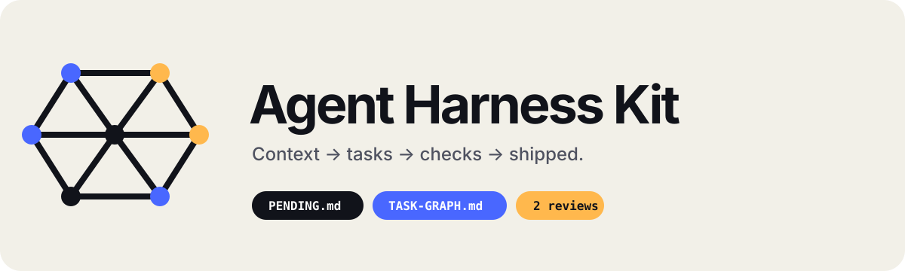

# Agent Harness Kit



<p align="center">
  <strong>Give coding agents durable context, bounded execution, and a clear path to completion.</strong><br>
  Platform-neutral contracts with native entrypoints for Codex and Claude Code.
</p>

<p align="center">
  
  
  
  
  
  
</p>

<p align="center">
  <a href="README.pt-BR.md">Português (Brasil)</a> · <a href="#start-here">Start here</a> · <a href="#choose-your-pace">Modes</a> · <a href="docs/ARCHITECTURE.md">Architecture</a>
</p>

**Source version: `0.5.3`.** The Kit is an executable, artifact-driven scaffold. Capable agents follow its files, contracts, and validators; it is not a daemon that launches agents or locks the operating system.

## Start here

Open any terminal, including the integrated terminal in VS Code, and install the CLI once. [`uv`](https://docs.astral.sh/uv/) is the recommended isolated option:

```bash
uv tool install agent-harness-kit-cli
```

You can also use `pipx` or install directly from PyPI with `pip`:

```bash
pipx install agent-harness-kit-cli
python -m pip install agent-harness-kit-cli
```

On Windows, `py -m pip install agent-harness-kit-cli` is also supported. Prefer a virtual environment when using plain `pip`; `uv` and `pipx` isolate the CLI automatically.

Then open the project you want to organize and run:

```bash
agent-harness install
```

Open a **new agent context at the project root**. The Kit will introduce itself, inspect only the initial state it needs, and begin a short discovery before proposing implementation.

> Prefer to preview first? Run `agent-harness install --dry-run`. Existing root instructions are preserved through managed blocks and namespaced coexistence.

## Choose your pace

| Say this | What happens |
| --- | --- |
| “Use standard delivery” | Full discovery where needed, bounded implementation, checks, and independent assurance |
| “Use hackathon mode” | At most two cohesive discovery questions, then a demo-first graph aimed at a testable MVP |
| “I also want to learn” | Adds guided learning only after you approve the exact Markdown, Obsidian, Notion/MCP, or other note destination |

Hackathon mode keeps state, file leases, checks, and status, but uses light review by default and cuts secondary scope before the primary demo path.

## Prefer to listen?

Listen to a short English explanation of what the project does and how its workflow fits together.

https://github.com/user-attachments/assets/8f5776d8-6d77-4b37-9712-004c21c3a17e

[Download the English MP3](media/agent-harness-kit-overview-en.mp3) · [Read the English script](media/overview-script-en.txt)

## Why it exists

| Without durable coordination | With the Kit |
| --- | --- |
| The agent rescans and guesses context | Approved context is read before broad inspection |
| Human decisions mix with technical tasks | `PENDING.md` and `TASK-GRAPH.md` have separate authority |
| Reviews repeat indefinitely | One review and at most one focused re-review |
| Completion waits for ceremonial approval | Passing work is completed, reported, and advances |
| Multiple agents collide | Workstreams, ownership leases, and handoffs are explicit |
| Study notes land in arbitrary folders | Learning starts only after the destination is approved |

## What changes in your project

- `PROJECT-CONTEXT.md` records the approved product, constraints, mode, and important decisions.
- `PENDING.md` answers what still needs a human and what remains unfinished at product level.
- `TASK-GRAPH.md` owns technical order, dependencies, leases, progress, and the next ready work.
- Root `AGENTS.md` and `CLAUDE.md` route capable agents into the same platform-neutral rules contained in `agent-harness-kit/`.

Frontend, backend, data, infrastructure, integration, and learning use separate contexts when the host supports them. Every active node can declare a focused `read_set`, exclusive `write_set`, related `impact_set`, and source revision, reducing broad rescans without inventing a second graph.

## The working loop

1. The agent reads approved context, then human/macro pending work, then the technical graph.
2. It loads only the active task and its direct context, takes an exclusive file lease, and implements within the declared budget.
3. Passing work is completed and reported immediately; the next ready task can start without ceremonial approval.
4. Independent review runs as non-blocking assurance: one proportional review and, only for a real blocker, at most one focused re-review. There is no third loop.

Every progress update includes stage, progress, work continuing automatically, human and technical pending items, blockers, next action, and inspectable paths.

## Profiles

| Profile | Includes | Best for |
| --- | --- | --- |
| `core` | Delivery, graph, status, review, validation | Most projects |
| `core-learning` | `core` plus optional project learning | Guided practice and debriefs |
| `full` | `core-learning` plus the separate harness study pack | Studying harness engineering itself |

Learning support is never silently activated. The user chooses the exact Markdown path, Obsidian location, Notion target/MCP, or another destination before any note is created.

## New project or existing harness

In an empty project, discovery comes before stack, architecture, branding, or feature proposals. In a mature repository, the Kit preserves existing instructions and uses namespaced coexistence; it never silently overwrites `AGENTS.md`, `CLAUDE.md`, `.agents/`, `.claude/`, or another authority. See the [mature-adoption playbook](harness/playbooks/mature-harness-adoption.md).

## Honest boundaries

- The Kit coordinates capable agents through files; it does not autonomously open chats, merge branches, deploy, or publish notes.
- Leases are validated contracts, not OS-level locks.
- Threads, subagents, worktrees, MCPs, network, and model choice depend on the host's real capabilities and authorization.
- A knowledge graph can reduce broad scans, but only scoped queries and execution budgets prevent waste; no tool guarantees lower token usage. See the [scoped graph execution contract](docs/SCOPED-GRAPH-EXECUTION.md) for the `read_set`, `write_set`, `impact_set`, provenance, and Graphify boundaries.

Need more detail? Read the [step-by-step installation guide](docs/EMBEDDED-INSTALLATION.md), [hackathon mode](docs/HACKATHON-MODE.md), [architecture](docs/ARCHITECTURE.md), [validation contract](docs/VALIDATION.md), [publication readiness audit](docs/PUBLICATION-READINESS.md), and [MIT License](LICENSE).
