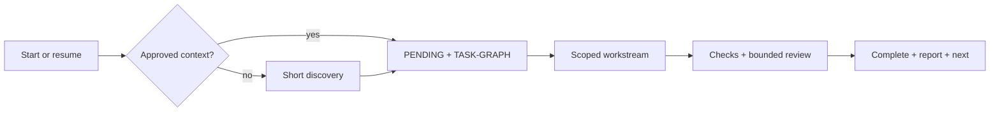

# Agent Harness Kit


<p align="center">
  <strong>Give coding agents durable context, bounded execution, and a clear path to completion.</strong><br>
  Platform-neutral contracts with native entrypoints for Codex and Claude Code.
</p>

<p align="center">
  <a href="README.pt-BR.md">Português (Brasil)</a> · <a href="#install-in-30-seconds">Install</a> · <a href="docs/ARCHITECTURE.md">Architecture</a> · <a href="docs/EMBEDDED-INSTALLATION.md">Contained updates</a>
</p>

**Source version: `0.5.0`.** The Kit is an executable, artifact-driven scaffold. Capable agents follow its files, contracts, and validators; it is not a daemon that launches agents or locks the operating system.

## Project overview audio

Listen to a short English explanation of what the project does and how its workflow fits together.

https://github.com/user-attachments/assets/8d0d1956-5199-43d2-9cf7-3a4b625553bd

[Download the English MP3](media/agent-harness-kit-overview-en.mp3) · [Read the English script](media/overview-script-en.txt)

## Why it exists

| Without durable coordination | With the Kit |
| --- | --- |
| The agent rescans and guesses context | Approved context is read before broad inspection |
| Human decisions mix with technical tasks | `PENDING.md` and `TASK-GRAPH.md` have separate authority |
| Reviews repeat indefinitely | One review and at most one focused re-review |
| Completion waits for ceremonial approval | Passing work is completed, reported, and advances |
| Multiple agents collide | Workstreams, ownership leases, and handoffs are explicit |
| Study notes land in arbitrary folders | Learning starts only after the destination is approved |


## Greenfield or existing harness

In an empty project, the first response introduces the Kit and starts a short discovery before proposing technology, architecture, or visual direction. In a mature repository, the Kit preserves existing instructions and uses namespaced coexistence; it never silently overwrites `AGENTS.md`, `CLAUDE.md`, `.agents/`, `.claude/`, or another authority. See the [mature-adoption playbook](harness/playbooks/mature-harness-adoption.md).

## Install in 30 seconds

With [`uv`](https://docs.astral.sh/uv/) installed, install the CLI once:

```bash
uv tool install agent-harness-kit-cli
```

Then run this inside each project that should receive the Kit:

```bash
agent-harness install
```

Then open a **new agent context at that project root**. The command installs the recommended `core` profile, creates a contained `agent-harness-kit/` directory, and adds managed routing blocks to root `AGENTS.md` and `CLAUDE.md` without replacing existing instructions.

```bash
# Preview only
agent-harness install --dry-run

# Include consented project-learning support
agent-harness install --profile core-learning
```

For clone/ZIP, beginners, offline use, troubleshooting, and contained updates, see the [step-by-step installation guide](docs/EMBEDDED-INSTALLATION.md). The original `python tools/install.py` interface remains supported.

## What gets installed

- Approved project context, rules, capabilities, and decisions.
- Human decisions/actions and macro gaps in `harness-state/PENDING.md`.
- Technical order, dependencies, leases, and transitions in `harness-state/TASK-GRAPH.md`.
- Bounded attempts, context expansion, and independent review—with no automatic third review.
- Mandatory status: stage, progress, automatic work, both pending views, blockers, next action, and inspectable paths.
- Separate frontend, backend, data, infrastructure, integration, and learning contexts when the host supports them.

## Hackathon mode

Ask for “hackathon mode,” a time-boxed MVP, or a demo-first build and the Kit compresses discovery to at most two cohesive questions before proposing the context and graph. It targets one demonstrable vertical slice, divides isolated work by area/agent, integrates early, uses a light independent review by default, and finishes with a rehearsed demo plus visible shortcuts and post-MVP gaps. It is faster, but it does not remove leases, checks, status, or the two-review ceiling. See [hackathon mode](docs/HACKATHON-MODE.md).

## How execution flows



`PENDING.md` answers “what do you need from me?” and tracks what remains at product level. `TASK-GRAPH.md` controls technical execution. The agent reads both—in that order after project context—and persists graph changes before reporting progress.

## A smarter task graph

The existing `TASK-GRAPH.md` also carries scoped code context per node: `read_set` tells the agent what to load first, `write_set` remains the exclusive lease, and `impact_set` bounds regression review. `context_provenance` records the source revision and how those hints were found. An approved, fresh tool such as [Graphify](https://github.com/Graphify-Labs/graphify) may enrich these fields, but it never creates a competing graph or changes task state automatically.

## Profiles

| Profile | Includes | Best for |
| --- | --- | --- |
| `core` | Delivery, graph, status, review, validation | Most projects |
| `core-learning` | `core` plus optional project learning | Guided practice and debriefs |
| `full` | `core-learning` plus the separate harness study pack | Studying harness engineering itself |

Learning support is never silently activated. The user chooses the exact Markdown path, Obsidian location, Notion target/MCP, or another destination before any note is created.

## Honest boundaries

- The Kit coordinates capable agents through files; it does not autonomously open chats, merge branches, deploy, or publish notes.
- Leases are validated contracts, not OS-level locks.
- Threads, subagents, worktrees, MCPs, network, and model choice depend on the host's real capabilities and authorization.
- A knowledge graph can reduce broad scans, but only scoped queries and execution budgets prevent waste; no tool guarantees lower token usage.

Read the [publication readiness audit](docs/PUBLICATION-READINESS.md), [validation contract](docs/VALIDATION.md), [open decisions](OPEN-DECISIONS.md), and [MIT License](LICENSE).
