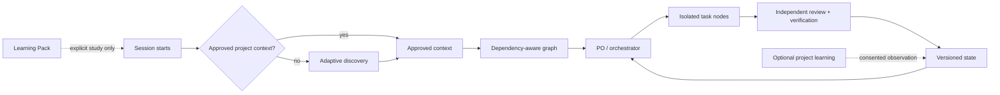

# Agent Harness Kit

> Agent Harness Kit is one platform-neutral, artifact-driven development harness with native Codex and Claude Code entrypoints, optional project learning, and a separate harness-engineering study pack.

[Português (Brasil)](README.pt-BR.md) · [Agent map](AGENTS.md) · [Architecture](docs/ARCHITECTURE.md) · [Model routing](docs/MODEL-ROUTING.md) · [Review rounds](docs/REVIEW-ROUNDS.md) · [Change integration](docs/CHANGE-INTEGRATION.md) · [Packaging](docs/DISTRIBUTION.md) · [Readiness audit](docs/PUBLICATION-READINESS.md) · [Open decisions](OPEN-DECISIONS.md)

🔊 Audio overview (legacy approved audio; capability-routing refresh pending): [English](media/agent-harness-kit-overview-en.mp3) ([current script](media/overview-script-en.txt)) · [Português (Brasil)](media/agent-harness-kit-overview-pt-BR.mp3) ([roteiro atual](media/overview-script-pt-BR.txt))

## Why use it

Use this scaffold when agent-assisted development needs durable project context, bounded roles, dependency-aware tasks, exclusive write ownership, independent review, reproducible evidence, and cost-aware model selection instead of state that exists only in chat. Every profile ships both native entrypoints: Codex reads root `AGENTS.md`; Claude Code reads root `CLAUDE.md`, which imports `@AGENTS.md`. Both route into the same neutral core and state without runtime guessing or manual profile switching. The same repository can be opened with either tool at different times without competing harness authority.

## Greenfield or an existing harness

Agent Harness Kit supports both new projects and mature repositories that already have Claude context, Codex instructions, platform-specific agents/rules, knowledge stores, pending-work authorities, or a custom harness.

- **Greenfield:** adaptive discovery creates the first approved project context and task graph.
- **Mature repository:** the kit does not assume an automatic lossless conversion or overwrite root instructions. It inventories and freezes existing authorities, installs through namespaced staged coexistence, classifies every material rule/decision/constraint/responsibility with source identity and backlinks, and validates structural coverage. Existing originals remain authoritative until humans review semantic equivalence and separately authorize cutover or removal.

Use the [mature-existing-harness adoption playbook](harness/playbooks/mature-harness-adoption.md), [migration-manifest contract](docs/contracts/MIGRATION-MANIFEST.md), and [coexistence/precedence contract](docs/contracts/COEXISTENCE.md).

## Choose an experience

| Experience | Runtime | Intended use | Distribution profile |
| --- | --- | --- | --- |
| Development Core | One delivery graph, roles, review, verification | Smallest development-only setup | `core` |
| Development Core + project learning | Same core plus consented learning from current project work | Delivery with guided practice/debriefs | `core-learning` |
| Harness Engineering Learning Pack | Static, project-independent study modules; never runtime-loaded by default | Learn how this harness works | Included only in `full` |

These are not three harnesses. All profiles are generated from one source version; no edition lives on a long-lived branch.

Choose `core` for the smallest operational package. Choose `core-learning` when you want consented assessment and debriefing from the current software project. Choose `full` when you also want the independently navigable `learning-pack/` for studying harness engineering. See [distribution details](docs/DISTRIBUTION.md).

Selecting or installing `core-learning`/`full` does **not** activate learning. Consent, observation, retention, and publication remain off until separately approved.

All three profiles support greenfield use and namespaced mature-harness adoption; profile choice changes included learning material, not migration safety or authority rules.

Every profile also contains both native platform entrypoints and their small on-demand extensions. Choose a profile by learning needs—not by Codex versus Claude Code.

## Prerequisites

- A project directory and an AI coding agent able to read/write Markdown files.
- Python 3 to run the included validator and bundle builder; they use only the standard library.
- Codex or Claude Code for native entrypoint activation. A capable human/agent can follow the neutral playbooks on another platform.
- Git, worktrees, multiple agents, sandboxing, hooks, MCP, network, and external integrations are optional capabilities and must degrade visibly when unavailable. The kit does not install, authenticate, or enable them.

## Quick start

1. Download or clone the canonical source, or choose a generated profile above. For a contained installation, copy the profile into `agent-harness-kit/` and add the minimal root bridges described in [embedded installation](docs/EMBEDDED-INSTALLATION.md). A root-layout copy remains supported for a new project that intentionally gives the Kit those paths.
2. Open the project in Codex or Claude Code. Codex naturally reads [AGENTS.md](AGENTS.md); Claude Code naturally reads [CLAUDE.md](CLAUDE.md), which imports the same map. No profile switch or runtime platform guess is needed. Do not ask for implementation planning yet.
3. Because `harness-state/PROJECT-CONTEXT.md` is initially absent, the agent follows [first-run discovery](harness/playbooks/first-run.md), inspects greenfield/existing state, asks only unresolved questions, and records consequential [decisions](harness/templates/DECISION.md).
   If the repository already has mature harness instructions, roles, rules, knowledge, or pending-work authority, use [namespaced mature adoption](harness/playbooks/mature-harness-adoption.md), preserve originals, and obtain semantic sign-off before any cutover.
4. Select `delivery` or `delivery+learning`, review the generated [project context](harness/templates/PROJECT-CONTEXT.md), and explicitly approve it.
   Discovery also builds or references a [capability manifest](harness/templates/CAPABILITY-MANIFEST.md) and [rules map](harness/templates/RULES-MAP.md). Capabilities cover native platform tools, MCP servers/connectors, skills, scripts/commands, hooks, and external integrations; absent evidence means unavailable, optional, or approval-required—not assumed access. Rules may cover business behavior, security/privacy, architecture, coding conventions, and paths, and are routed only to relevant work.
5. The decomposer proposes and validates the initial [task graph](harness/templates/TASK-GRAPH.md); the orchestrator then dispatches a bounded [task brief](harness/templates/TASK.md). Dispatch follows [capability-based model routing](docs/MODEL-ROUTING.md): balanced is the normal default, economical is limited to deterministic low-risk work, and frontier is reserved for consequential judgment or explicit escalation triggers. Provider-specific model names stay in adapters and current host evidence.
   Role definitions are editable templates: discovery can adapt existing roles or propose project-specific specialists, responsibilities, tool access, context packets, ownership boundaries, and review criteria. This is governed configuration, not uncontrolled agent self-modification. Consequential changes to tools, permissions, secrets, network, destructive actions, hooks, integrations, or durable rules require explicit human approval and validation.
6. The specialist works only in its leased paths, runs declared checks, and writes a [handoff](harness/templates/HANDOFF.md). A different reviewer writes the [review result](harness/templates/REVIEW.md); only the orchestrator accepts the node. Review uses a `light`, `standard`, or `critical` profile with [two rounds maximum](docs/REVIEW-ROUNDS.md): one initial review and, only for blocking findings, one focused re-review. A second failure stops and escalates/decomposes the task. Related microcorrections form one [coherent change unit](docs/CHANGE-INTEGRATION.md) unless meaningful boundaries require a split. Technical acceptance never grants commit, push, deploy, or publication authority.
7. In `delivery+learning`, project-learning roles may update the consented learning queue after delivery evidence exists. In `full`, open `learning-pack/README.md` separately when you want to study the harness itself.
8. Run `python tools/validate.py`. Build a bundle outside the source tree with `python tools/package.py --profile core --output <outside-directory>`; substitute `core-learning` or `full` as needed.

## Contained project installation

The recommended low-collision layout keeps the selected profile under `agent-harness-kit/`. Root `AGENTS.md` and `CLAUDE.md` receive only managed bridge blocks; existing content is preserved. Project-specific operational state remains in root `harness-state/`, outside the replaceable Kit directory. See the [installation guide](docs/EMBEDDED-INSTALLATION.md) and bridge templates for [Codex](harness/templates/ROOT-AGENTS-BRIDGE.md) and [Claude Code](harness/templates/ROOT-CLAUDE-BRIDGE.md).

Nested native skills or subagents are not assumed to be auto-discovered. First-run capability discovery records the actual behavior and uses explicit neutral playbook paths when native registration is degraded.

## First run

If the host project has no approved `harness-state/PROJECT-CONTEXT.md`, implementation planning must wait. Follow [first run](harness/playbooks/first-run.md): inspect existing versus greenfield state, run adaptive discovery, fill gaps, record decisions for confirmation, select `delivery` or `delivery+learning`, obtain approval, and only then create the initial graph. Adapters may surface this gate differently but cannot bypass it.

This gate is native on both supported tools: Codex reaches it through `AGENTS.md`; Claude Code reaches the identical rule through `CLAUDE.md` and its `@AGENTS.md` import. Opening the repository later with the other tool does not create a second context or graph—it reads the same approved neutral artifacts.

On the first request in a new context window, a resume/continue request, or a status request, the agent must read approved project context first, the project's pending-work authority second, and the task graph third. It may inspect task-local evidence only after that sequence. A repository-wide scan is allowed only when those artifacts expose a concrete gap/conflict, a recovery playbook requires it, or the user explicitly requests an audit. See [status and resume](harness/playbooks/status-resume.md).

Before or during onboarding, you may ask for a plain-language explanation of the harness and what will happen next. This explanation is optional and cannot block delivery. It does not activate project learning, consent, observation, retention, publication, or the Harness Engineering Learning Pack; those remain separate explicit choices. See the [discovery interview](docs/DISCOVERY-INTERVIEW.md).



## Repository map

```text
docs/                  product, architecture, contracts, validation, distribution
harness/roles/         bounded operational authority
harness/templates/     reusable state artifacts
harness/playbooks/     neutral transitions and first-run policy
adapters/               generic contract plus native Codex/Claude mappings
.agents/skills/         on-demand Codex workflow routing
.claude/skills/         on-demand Claude Code workflow routing
.claude/agents/         bounded Claude Code role adapters
examples/               both runtime modes through the same core
learning-pack/          removable harness-engineering study modules
distribution/           generated-profile manifests
tools/                  dependency-free validation and packaging
media/                  bilingual audio plus versioned narration scripts
```

Operational agents start at [AGENTS.md](AGENTS.md). In the `full` profile, harness learners start at `learning-pack/README.md`, which operational agents must not preload.

See [bounded roles](harness/roles/README.md) for customization rules. Adapted roles must preserve orchestrator/reviewer independence, least capability, exclusive ownership, objective verification, and project-learning non-interference.

Human-approved durable rules are versioned in or referenced by the rules map; temporary task context is not a rule. During mature adoption, existing project/platform rules and precedence remain preserved until reviewed cutover.

## Principles

1. Files carry state; messages only announce changes.
2. Context is progressive and revision-pinned; session start/status reads project context, pending work, then task graph before broad inspection.
3. The orchestrator coordinates the graph; agents loop inside nodes.
4. Concurrent work has exclusive write sets and declared isolation.
5. Review is independent, risk-proportional, and bounded to one initial round plus at most one focused re-review; verification is objective and recorded.
6. Consequential product, architecture, scope, permission, override, and publication choices require human approval.
7. Project learning is optional and cannot mutate delivery control state.
8. Capabilities and degradation are explicit; adapters never invent support.
9. Models are routed by capability and risk; stronger models grant no additional authority.
10. Changes follow coherent acceptance and rollback units; commit, integration, push, deploy, and publication remain separate gates.

## Current status

**Native first-version operating scaffold.** Codex activates through `AGENTS.md`; Claude Code activates through `CLAUDE.md` importing `@AGENTS.md`. Both ship small native skills, Claude has bounded project subagents, and all routes converge on the neutral contracts and state. Roles, templates, playbooks, examples, learning modules, capability-tier routing, bounded review rounds, coherent change integration, fixtures, validation, deterministic packaging, and auditable audio scripts exist. A separate autonomous runtime that independently calls APIs, dispatches agents, provisions isolation, merges branches, or publishes notes remains future work.

```text
python tools/validate.py
python tools/package.py --profile core --output <outside-directory>
```

## Next phase

1. Run and record the planned interactive Codex/Claude onboarding simulations.
2. Implement an optional external autonomous orchestrator with atomic revisions and leases.
3. Add runtime transition, retry, checkpoint, recovery, and non-interference fixtures.
4. Exercise native first-run discovery against greenfield and mature-host fixtures on supported installations.
5. Keep `0.1.0` as the initial public version and decide release automation only when release scope is approved.

See [OPEN-DECISIONS.md](OPEN-DECISIONS.md); unchecked items are never implicit permission.

## License and community

Licensed under the [MIT License](LICENSE), copyright 2026 Agent Harness Kit contributors. See the [contribution guide](.github/CONTRIBUTING.md), [security policy](.github/SECURITY.md), and [support policy](.github/SUPPORT.md).
