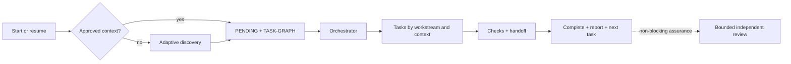

# Agent Harness Kit

> A platform-neutral, artifact-driven development harness with native Codex and Claude Code entrypoints, optional project learning, and a separate harness-engineering study pack.

**Current source version: `0.4.1`.** This is an executable operating scaffold: capable agents follow its contracts and validators. It is not a daemon that independently launches agents or locks files at the operating-system level.

> 🌐 **Language:** English
>
> **[Português (Brasil)](README.pt-BR.md)** — switch language

[Beginner installation](#beginner-installation) · [Contained installation](docs/EMBEDDED-INSTALLATION.md) · [How it works](#how-it-works) · [Architecture](docs/ARCHITECTURE.md) · [Status/completion](docs/STATUS-AND-COMPLETION.md) · [Packaging](docs/DISTRIBUTION.md) · [Open decisions](OPEN-DECISIONS.md)

## Greenfield or an existing harness

Agent Harness Kit supports both new projects and repositories that already contain instructions, agents, rules, knowledge, or another harness.

- **Greenfield:** discovery creates the first approved project context and task graph.
- **Existing repository:** the kit preserves current authorities, installs through namespaced coexistence, and allows cutover only after human semantic-equivalence review.

It does not silently overwrite `AGENTS.md`, `CLAUDE.md`, `.agents/`, `.claude/`, or existing configuration. See the [adoption playbook](harness/playbooks/mature-harness-adoption.md).

## Project explanation audio

Listen to an English overview of the purpose and workflow of Agent Harness Kit.

https://github.com/user-attachments/assets/8d0d1956-5199-43d2-9cf7-3a4b625553bd

[Download the English MP3](media/agent-harness-kit-overview-en.mp3) · [Read the English narration script](media/overview-script-en.txt)

## What the harness provides

| Area | Behavior |
| --- | --- |
| Durable state | Approved context, decisions, human/macro `PENDING.md`, and technical `TASK-GRAPH.md` |
| Execution | Dependencies, exclusive file ownership, handoffs, checks, and automatic next-task progress |
| Contexts | Frontend, backend, data, infrastructure, and integration separated by task/agent when the host supports it |
| Status | Stage, progress, pending work by area, blockers, next action, and inspectable paths |
| Frontend | Default visual direction, mockup, image generation, and image-to-code workflow |
| Learning | Consented study mode with notes in Markdown, a local path, Obsidian, Notion, or another destination |
| Resource control | Two implementation attempts, two no-progress cycles, and three context expansions per goal lineage |
| Assurance | Independent reviewer, two reviews maximum, and no bureaucratic wait after passing checks |

Missing capabilities degrade explicitly. The harness never assumes MCP, network, secrets, authentication, worktrees, thread creation, or permissions.

## Profiles

| Profile | Includes | Best for |
| --- | --- | --- |
| `core` | Delivery, graph, status, review, and validation | Development without guided learning |
| `core-learning` | `core` plus project learning | Guided practice and debriefs during delivery |
| `full` | `core-learning` plus `learning-pack/` | Delivery and separate harness-engineering study |

Installing `core-learning` or `full` does not activate observation or publication. Study mode starts only after an explicit request and consent.

## Prerequisites

- Python 3 and a project directory.
- Codex or Claude Code for native activation; other platforms can follow the neutral playbooks.
- Git, multiple agents, sandboxes, MCP, and network access are optional.

## Beginner installation

This process copies a contained version of the Kit into your project. It does not install an operating-system service or start agents by itself. The root `AGENTS.md` and `CLAUDE.md` files tell Codex or Claude Code where to find the Kit rules.

### 1. Prepare

- Install [Python 3](https://www.python.org/downloads/) and confirm it with `python --version` on Windows or `python3 --version` on macOS/Linux.
- Create or locate the project directory that will receive the Kit.
- Commit or back up important existing work before installation.

### 2. Download the Kit

Choose one option:

- **Clone:** `git clone https://github.com/Eduardo-Salvador/Agent-Harness-Kit.git`
- **Fork:** click **Fork** on GitHub, copy your fork URL, and run `git clone <YOUR-FORK-URL>`.
- **Without Git:** choose **Code → Download ZIP**, extract it, and name the folder `Agent-Harness-Kit`.

Keep the source/fork beside—not inside—the project that will receive the Kit:

```text
workspace/
├── Agent-Harness-Kit/   source repository, fork, or extracted ZIP
└── my-project/          project that will receive the Kit
```

The installer rejects the source directory itself and nested source/host layouts to prevent accidental recursive copies.

### 3. Open a terminal in your project

The terminal prompt should end in `my-project`. In the commands below, `.` means “the current directory” and `..` means “the parent directory” where `Agent-Harness-Kit` sits in the example.

### 4. Choose a profile

- `core` is recommended for most people who only want development orchestration.
- `core-learning` adds optional study-mode support and consented note capture.
- `full` also includes the separate harness-engineering study pack.

### 5. Preview without changing files

**Windows PowerShell**

```powershell
python ..\Agent-Harness-Kit\tools\install.py --profile core --host . --dry-run
```

**macOS or Linux**

```bash
python3 ../Agent-Harness-Kit/tools/install.py --profile core --host . --dry-run
```

Review the `WOULD` lines. They must point to `my-project`, not the Kit source.

### 6. Install

Run the same command without `--dry-run`:

```powershell
python ..\Agent-Harness-Kit\tools\install.py --profile core --host .
```

On macOS/Linux, use `python3 ../Agent-Harness-Kit/tools/install.py --profile core --host .`. If the directories are not siblings, replace the relative installer path with its full path and quote paths containing spaces.

Successful `DONE` lines report the contained `agent-harness-kit/` copy and the managed root `AGENTS.md` and `CLAUDE.md` bridges. Existing root instructions remain outside the managed block.

### 7. Validate

```text
python agent-harness-kit/tools/validate.py
```

Expect `VALIDATION PASSED`. Do not begin development if the validator reports errors.

### 8. Open a new agent context

Open a **new context at the `my-project` root** so the host reloads `AGENTS.md` or `CLAUDE.md`. An older conversation may still hold instructions loaded before installation. If the host does not load root instructions automatically, paste this fallback prompt:

```text
Agent Harness Kit is installed in this project. Before scanning, proposing, planning, reporting status, or changing files, read the applicable root AGENTS.md or CLAUDE.md, then follow the referenced instructions under agent-harness-kit/. Check harness-state/PROJECT-CONTEXT.md and run the required first-run or resume flow before answering the project request.
```

Without approved context, the correct first response briefly introduces the Kit and starts discovery. It must not propose a stack, brand, architecture, or implementation first.

<details>
<summary><strong>Common problems</strong></summary>

- **Python is not recognized:** install Python 3, reopen the terminal, and retry; use `python3` on macOS/Linux.
- **Path or file not found:** verify the source folder name/location or use the full quoted installer path.
- **`destination already exists`:** the project already contains `agent-harness-kit/`. Preserve `harness-state/` and follow [contained updates](docs/EMBEDDED-INSTALLATION.md).
- **`separate, non-nested directories`:** move the Kit source and project so neither contains the other.
- **The agent skipped the welcome:** open a genuinely new context at the project root and paste the activation prompt above.

</details>

## How it works



### Resume and pending work

On the first request in a new context window, a resume request, or a status request, the agent reads:

1. `harness-state/PROJECT-CONTEXT.md`;
2. `harness-state/PENDING.md`;
3. `harness-state/TASK-GRAPH.md`.

`PENDING.md` owns human decisions/actions and the macro completion view. `TASK-GRAPH.md` owns technical order, dependencies, leases, and execution. Every progress/step update—not only an explicit status request—shows current stage, progress, what continues without user action, human and macro pending items, active/ready/blocked graph nodes, blockers, next action, and inspectable paths. For “what do you need from me?”, human items come first.

Technical movement is persisted in a new `TASK-GRAPH.md` revision before it is reported. `PENDING.md` is updated only when human action or the macro project outcome changes; it is never the sole record of task progress.

### Contexts, frontend, and learning

- **Contexts:** a fresh context per task is the default. Visible threads, subagents, and parallelism are used only when the host exposes and authorizes them; otherwise the harness uses a manual or serialized artifact-handoff fallback.
- **Frontend:** screen requests use `frontend-screen` for orchestration. With approved screenshots, `image-to-code` is the primary coding skill, `frontend-screen` checks desktop/mobile fidelity, and `imagegen` creates only temporary photographs/raster assets. Design-direction skills remain available when no approved screen exists.
- **Learning:** requests such as “enable study mode” begin setup for goals, observation boundaries, and the exact note destination. No note is created and no `docs/` or remote fallback is assumed before the user confirms a path or a connector/MCP plus target. Credentials are never stored in the profile.

## Repository map

```text
AGENTS.md / CLAUDE.md   native entrypoints
harness/                roles, templates, and playbooks
docs/                   architecture, contracts, and policy
adapters/               Codex, Claude, and generic mappings
.agents/ / .claude/     on-demand skills and agents
validation/             valid fixtures and hostile mutations
tools/                  installation, validation, and packaging
learning-pack/          separate harness-engineering study
```

## Principles

1. Files—not chat memory—carry durable state.
2. Human/macro `PENDING.md` and technical `TASK-GRAPH.md` are separate authorities.
3. Tasks have exclusive ownership, progressive context, and reproducible verification.
4. Implementer and reviewer are independent; there is no automatic third review.
5. Passing work reports completion and continues without bureaucratic approval.
6. Models and tools do not expand authority; capability and degradation remain explicit.

## Current limitations

- No separate autonomous runtime opens sessions, integrates branches, deploys, or publishes notes by itself.
- File leases are validated graph contracts, not operating-system locks.
- Automatic thread creation, subagents, and isolation depend on actual host capabilities.
- Token metering, time limits, and forced termination are not yet portable across hosts.

See the [readiness audit](docs/PUBLICATION-READINESS.md), [open decisions](OPEN-DECISIONS.md), and [MIT License](LICENSE).
