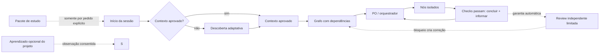

# Agent Harness Kit

> Agent Harness Kit é um único harness de desenvolvimento, agnóstico de plataforma e orientado a artefatos, com entradas nativas para Codex e Claude Code, aprendizado de projeto opcional e um pacote separado para estudar engenharia de harness.

[English](README.md) · [Mapa dos agentes](AGENTS.md) · [Status e conclusão](docs/STATUS-AND-COMPLETION.md) · [Arquitetura](docs/ARCHITECTURE.md) · [Roteamento de modelos](docs/MODEL-ROUTING.md) · [Rodadas de review](docs/REVIEW-ROUNDS.md) · [Integração de mudanças](docs/CHANGE-INTEGRATION.md) · [Distribuição](docs/DISTRIBUTION.md) · [Auditoria de prontidão](docs/PUBLICATION-READINESS.md) · [Decisões em aberto](OPEN-DECISIONS.md)

## Ouça a visão geral

**English** · [script atual](media/overview-script-en.txt)

https://github.com/user-attachments/assets/b9f7771b-0bde-4622-a369-24d4c0de955c

[MP3 alternativo / download](media/agent-harness-kit-overview-en.mp3)

**Português (Brasil)** · [roteiro atual](media/overview-script-pt-BR.txt)

https://github.com/user-attachments/assets/2fed6fc3-09a8-4493-9233-69f1fb320036

[MP3 alternativo / download](media/agent-harness-kit-overview-pt-BR.mp3)

Os áudios legados aprovados continuam reproduzíveis aqui enquanto a nova narração não é gravada.

## Por que usar

Use este scaffold quando o desenvolvimento com agentes precisar de contexto durável, papéis delimitados, tarefas com dependências, propriedade exclusiva de arquivos, revisão independente, evidências reproduzíveis e seleção de modelos consciente de custo, em vez de estado mantido apenas no chat. Todos os perfis trazem as duas entradas nativas: o Codex lê `AGENTS.md` na raiz; o Claude Code lê `CLAUDE.md`, que importa `@AGENTS.md`. Os dois chegam ao mesmo núcleo e estado neutros, sem adivinhar a plataforma em runtime nem trocar o perfil manualmente. O mesmo repositório pode ser aberto com uma ferramenta em um momento e com a outra depois, sem autoridades concorrentes do harness.

**Versão atual do código-fonte: `0.3.0`.** O projeto é um scaffold operacional executável e orientado a artefatos: sessões capazes do Codex/Claude seguem seus contratos e validadores. Ele não é um daemon separado que inicia agentes sozinho ou bloqueia arquivos no sistema operacional.

## O que a 0.3.0 entrega

| Área | Comportamento entregue |
| --- | --- |
| Ativação nativa | Núcleo neutro compartilhado, acessado por `AGENTS.md` no Codex e `CLAUDE.md` no Claude Code |
| Estado do projeto | Contexto aprovado, `PENDING.md` humano/macro e `TASK-GRAPH.md` técnico com ordem rígida de leitura |
| Status | Contrato executável `harness.status/v1` com etapa, progresso, bloqueios, próxima ação, itens humanos e caminhos inspecionáveis |
| Execução | Dependências, leases/write sets declarados, colisões validadas, handoffs, evidências e avanço automático para a próxima task |
| Garantia | Revisor independente, no máximo duas reviews, segunda focada e reescrita/decomposição/decisão humana após segunda reprovação |
| Segurança e portabilidade | Manifestos de capacidades/regras, degradação explícita, coexistência com harness maduro, adapters Codex/Claude e nenhuma ampliação silenciosa de permissão |
| Validação e entrega | Mutações hostis, testes do instalador e pacotes determinísticos `core`, `core-learning` e `full` a partir de uma versão |

## Projeto greenfield ou harness existente

Agent Harness Kit atende tanto projetos novos quanto repositórios maduros que já possuem contexto do Claude, instruções do Codex, agentes/regras específicos de plataforma, bases de conhecimento, autoridades sobre pendências ou um harness próprio.

- **Greenfield:** a descoberta adaptativa cria o primeiro contexto de projeto aprovado e o grafo de tarefas.
- **Repositório maduro:** o kit não presume conversão automática e sem perdas, nem sobrescreve instruções da raiz. Ele inventaria e congela as autoridades existentes, instala por coexistência gradual com namespace, classifica cada regra/decisão/restrição/responsabilidade material com identidade da fonte e backlinks, e valida a cobertura estrutural. Os originais continuam autoritativos até que pessoas revisem a equivalência semântica e autorizem separadamente o cutover ou a remoção.

Use o [playbook de adoção de harness existente](harness/playbooks/mature-harness-adoption.md), o [contrato do manifesto de migração](docs/contracts/MIGRATION-MANIFEST.md) e o [contrato de coexistência e precedência](docs/contracts/COEXISTENCE.md).

## Escolha uma experiência

| Experiência | Runtime | Uso | Perfil de distribuição |
| --- | --- | --- | --- |
| Núcleo de desenvolvimento | Um grafo de entrega, papéis, revisão e verificação | Configuração mínima, apenas desenvolvimento | `core` |
| Núcleo + aprendizado do projeto | O mesmo núcleo, com aprendizado consentido a partir do projeto atual | Entrega com prática guiada e debriefings | `core-learning` |
| Pacote de Engenharia de Harness | Módulos estáticos e independentes; nunca carregados no runtime por padrão | Entender como o harness funciona | Incluído apenas em `full` |

Não são três harnesses. Todos os perfis são gerados da mesma versão do código; nenhuma edição vive em uma branch de longa duração.

Escolha `core` para o pacote operacional mínimo. Escolha `core-learning` para adicionar avaliação e debriefing consentidos sobre o projeto atual. Escolha `full` quando também quiser o diretório independente `learning-pack/` para estudar engenharia de harness. Veja os [detalhes de distribuição](docs/DISTRIBUTION.md).

Selecionar ou instalar `core-learning`/`full` **não** ativa aprendizado. Consentimento, observação, retenção e publicação continuam desativados até aprovação separada.

Os três perfis atendem projetos greenfield e adoção com namespace em harnesses maduros; a escolha do perfil altera o material de aprendizado incluído, não as regras de segurança da migração ou de autoridade.

Todos também incluem as duas entradas de plataforma e suas pequenas extensões carregadas sob demanda. Escolha o perfil pela necessidade de aprendizado, não por Codex ou Claude Code.

## Pré-requisitos

- Um diretório de projeto e um agente de programação capaz de ler e escrever arquivos Markdown.
- Python 3 para executar o validador e o gerador de pacotes, ambos usando apenas a biblioteca padrão.
- Codex ou Claude Code para ativação nativa pela entrada correspondente. Em outra plataforma, uma pessoa ou agente capaz pode seguir os playbooks neutros.
- Git, worktrees, múltiplos agentes, sandboxes, hooks, MCP, rede e integrações externas são capacidades opcionais e devem degradar de forma explícita quando indisponíveis. O kit não instala, autentica nem ativa esses recursos.

## Início rápido

1. Baixe ou clone o código canônico, ou escolha um perfil gerado. Para instalar com segurança em outro projeto, execute `python tools/install.py --profile core --host <diretório-do-projeto>`. O instalador cria `agent-harness-kit/` e adiciona ou atualiza somente blocos de ponte gerenciados em `AGENTS.md` e `CLAUDE.md` da raiz, preservando as instruções existentes. Use `--dry-run` para inspecionar o plano antes. Veja [instalação embedded](docs/EMBEDDED-INSTALLATION.md). A cópia diretamente na raiz continua compatível com projetos novos que concedam esses caminhos ao Kit de forma intencional.
2. Abra o projeto no Codex ou no Claude Code. O Codex lê naturalmente [AGENTS.md](AGENTS.md); o Claude Code lê naturalmente [CLAUDE.md](CLAUDE.md), que importa o mesmo mapa. Não é preciso trocar de perfil nem adivinhar a plataforma em runtime. Ainda não peça o planejamento da implementação.
3. Como `harness-state/PROJECT-CONTEXT.md` não existe inicialmente, o agente segue a [descoberta inicial](harness/playbooks/first-run.md), identifica projeto greenfield ou existente, pergunta apenas o que falta e registra [decisões](harness/templates/DECISION.md) relevantes.
   Se o repositório já tiver instruções, papéis, regras, conhecimento ou pendências de um harness maduro, use a [adoção com namespace](harness/playbooks/mature-harness-adoption.md), preserve os originais e obtenha aprovação semântica antes de qualquer cutover.
4. Selecione `delivery` ou `delivery+learning`, revise o [contexto do projeto](harness/templates/PROJECT-CONTEXT.md) gerado e aprove-o explicitamente.
   A descoberta também cria ou referencia um [manifesto de capacidades](harness/templates/CAPABILITY-MANIFEST.md) e um [mapa de regras](harness/templates/RULES-MAP.md). Capacidades incluem ferramentas nativas da plataforma, servidores/conectores MCP, skills, scripts/comandos, hooks e integrações externas; sem evidência, ficam indisponíveis, opcionais ou dependentes de aprovação — nunca são presumidas. As regras podem cobrir negócio, segurança/privacidade, arquitetura, convenções de código e caminhos, e são encaminhadas apenas ao trabalho relevante.
5. O decompositor propõe e valida o [grafo inicial](harness/templates/TASK-GRAPH.md); o orquestrador então despacha uma [tarefa delimitada](harness/templates/TASK.md). O despacho segue o [roteamento por capacidade](docs/MODEL-ROUTING.md): balanceado é o padrão, econômico fica restrito a trabalho determinístico e de baixo risco, e avançado é reservado para decisões consequentes ou gatilhos explícitos de escalonamento. Nomes específicos de modelos ficam nos adaptadores e nas evidências atuais do host.
   As definições de papéis são templates editáveis: a descoberta pode adaptar papéis existentes ou propor especialistas específicos do projeto, responsabilidades, acesso a ferramentas, pacotes de contexto, limites de propriedade e critérios de revisão. Isso é configuração governada, não automodificação descontrolada dos agentes. Mudanças relevantes em ferramentas, permissões, segredos, rede, ações destrutivas, hooks, integrações ou regras duráveis exigem aprovação humana explícita e validação.
6. O especialista trabalha somente nos caminhos atribuídos, executa as verificações e escreve um [handoff](harness/templates/HANDOFF.md). Quando elas passam, o orquestrador marca o nó como concluído, informa o que mudou, libera a propriedade e despacha a próxima tarefa pronta sem pedir aprovação humana de conclusão. Outro agente registra automaticamente uma [revisão de garantia](harness/templates/REVIEW.md) não bloqueante. A review usa perfil `light`, `standard` ou `critical` com [no máximo duas rodadas](docs/REVIEW-ROUNDS.md); a segunda fica limitada aos bloqueios anteriores, ao delta da correção e às regressões relacionadas. Uma segunda reprovação obriga reescrita, decomposição ou uma decisão humana real de produto ou risco. Conclusão não autoriza separadamente commit, push, deploy ou publicação.
7. Em `delivery+learning`, os papéis de aprendizado podem atualizar a fila consentida depois que houver evidência de entrega. Em `full`, abra `learning-pack/README.md` separadamente quando quiser estudar o harness.
8. Execute `python tools/validate.py`. Gere um pacote fora da árvore fonte com `python tools/package.py --profile core --output <diretório-externo>`; troque o perfil quando necessário.

## Instalação contida no projeto

O layout recomendado com menos colisões mantém o perfil selecionado em `agent-harness-kit/`. Apenas baixar o Kit não altera outro repositório; executar o instalador contra o projeto cria essa pasta. Os arquivos `AGENTS.md` e `CLAUDE.md` da raiz recebem somente blocos de ponte gerenciados; o conteúdo existente é preservado. O estado operacional específico do projeto permanece em `harness-state/` na raiz, fora do diretório substituível do Kit.

```text
python tools/install.py --profile core --host <diretório-do-projeto> --dry-run
python tools/install.py --profile core --host <diretório-do-projeto>
```

Consulte o [guia de instalação](docs/EMBEDDED-INSTALLATION.md) e os templates de ponte para [Codex](harness/templates/ROOT-AGENTS-BRIDGE.md) e [Claude Code](harness/templates/ROOT-CLAUDE-BRIDGE.md).

A descoberta automática de skills ou subagentes aninhados não é presumida. A descoberta inicial registra o comportamento real e usa caminhos explícitos para os playbooks neutros quando o registro nativo estiver degradado.

## Primeiro uso

Se o projeto não tiver `harness-state/PROJECT-CONTEXT.md` aprovado, o planejamento da implementação deve esperar. O agente segue o [playbook de primeiro uso](harness/playbooks/first-run.md): identifica projeto existente ou greenfield, conduz descoberta adaptativa, preenche lacunas, registra decisões para confirmação, seleciona `delivery` ou `delivery+learning`, obtém aprovação e só então cria o grafo inicial.

Essa regra é nativa nas duas ferramentas: o Codex chega a ela por `AGENTS.md`; o Claude Code chega à mesma regra por `CLAUDE.md` e pela importação `@AGENTS.md`. Abrir o repositório depois com a outra ferramenta não cria outro contexto ou grafo — ela lê os mesmos artefatos neutros aprovados.

Na primeira solicitação de uma nova janela de contexto, em pedidos para continuar/retomar ou em pedidos de status, o agente deve ler primeiro o contexto aprovado, depois `harness-state/PENDING.md` e, por último, `harness-state/TASK-GRAPH.md`. `PENDING.md` contém decisões/ações humanas e a visão macro do que falta no projeto, como backend ou autenticação. `TASK-GRAPH.md` contém ordem, dependências e execução técnica. Em “minhas pendências”, os itens humanos vêm primeiro e o grafo não pode substituí-los. Toda resposta segue o [contrato executável de status](docs/contracts/STATUS.md): etapa, progresso, bloqueios, próxima ação e caminhos inspecionáveis são obrigatórios. Veja [status e retomada](harness/playbooks/status-resume.md).

Antes ou durante o onboarding, você pode pedir uma explicação em linguagem simples sobre o harness e o que acontecerá em seguida. Essa explicação é opcional e não pode bloquear a entrega. Ela não ativa aprendizado do projeto, consentimento, observação, retenção, publicação nem o Pacote de Engenharia de Harness; essas continuam sendo escolhas explícitas e separadas. Veja a [entrevista de descoberta](docs/DISCOVERY-INTERVIEW.md).



## Mapa do repositório

```text
docs/                  produto, arquitetura, contratos, validação e distribuição
harness/roles/         autoridade operacional delimitada
harness/templates/     artefatos reutilizáveis de estado
harness/playbooks/     transições neutras e política de primeiro uso
adapters/               contrato genérico e mapeamentos nativos para Codex/Claude
.agents/skills/         roteamento sob demanda dos fluxos no Codex
.claude/skills/         roteamento sob demanda dos fluxos no Claude Code
.claude/agents/         adaptações delimitadas de papéis no Claude Code
examples/               os dois modos usando o mesmo núcleo
learning-pack/          módulos removíveis para estudar o harness
distribution/           manifestos dos perfis gerados
tools/                  validação e empacotamento sem dependências
media/                  áudios bilíngues e roteiros versionados
```

Agentes operacionais começam em [AGENTS.md](AGENTS.md). No perfil `full`, quem deseja estudar o harness começa em `learning-pack/README.md`, que não deve ser pré-carregado por agentes operacionais.

Veja os [papéis delimitados](harness/roles/README.md) para conhecer as regras de personalização. Papéis adaptados devem preservar a independência entre orquestrador e revisor, a capacidade mínima, a propriedade exclusiva, a verificação objetiva e a não interferência do aprendizado do projeto.

Regras duráveis aprovadas por pessoas são versionadas no mapa de regras ou referenciadas por ele; contexto temporário da tarefa não é uma regra. Durante a adoção madura, regras e precedência existentes do projeto/plataforma continuam preservadas até o cutover revisado.

## Princípios

1. Arquivos carregam o estado durável; mensagens seguem um formato executável com etapa, progresso, bloqueios, próxima ação, caminhos inspecionáveis e pendências humanas reais.
2. O contexto é progressivo e fixado por revisão; `PENDING.md` contém ações humanas e lacunas macro, enquanto `TASK-GRAPH.md` contém ordem, dependências e execução técnica.
3. O orquestrador coordena o grafo; agentes iteram dentro dos nós.
4. Trabalho concorrente usa conjuntos exclusivos de escrita e isolamento declarado.
5. Tasks aprovadas nos checks são concluídas, informadas e seguidas pela próxima tarefa pronta sem aprovação humana; a review é uma garantia automática não bloqueante, limitada a uma rodada inicial e no máximo uma revisão focada da correção.
6. Decisões consequentes exigem aprovação humana.
7. O aprendizado do projeto é opcional e não altera o controle da entrega.
8. Capacidades e degradação são explícitas; adaptadores não inventam suporte.
9. Modelos são escolhidos por capacidade e risco; modelos mais fortes não recebem autoridade adicional.
10. Mudanças seguem unidades coerentes de aceitação e rollback; commit, integração, push, deploy e publicação continuam sendo gates separados.

## Estado atual

**Scaffold operacional da versão 0.3.0.** O Codex ativa por `AGENTS.md`; o Claude Code ativa por `CLAUDE.md`, importando `@AGENTS.md`. Ambos incluem skills nativas pequenas, o Claude tem subagentes de projeto delimitados, e todas as rotas convergem nos contratos e no estado neutros. Papéis, templates, playbooks, exemplos, módulos de estudo, roteamento por capacidade, rodadas limitadas de review, mutações negativas de status/review, integração coerente de mudanças, validação, empacotamento determinístico e roteiros auditáveis dos áudios existem.

```text
python tools/validate.py
python tools/package.py --profile core --output <diretório-externo>
```

## Limitações conhecidas

- Nenhum runtime autônomo separado chama APIs de modelos, inicia sessões, integra branches, faz deploy ou publica notas hoje.
- Leases de arquivo são contratos governados no grafo/write set com validação de colisão, não locks no sistema operacional; equivalência de symlink/case e recuperação de lease continuam como política pendente.
- As simulações interativas em instalações reais do Codex e Claude Code ainda são necessárias antes de prometer isolamento/delegação automatizados em todo host.
- As faixas executáveis ainda contêm a narração legada aprovada; os roteiros versionados atuais precisam ser regravados e ouvidos por uma pessoa.

## Próxima fase

1. Executar e registrar as simulações interativas planejadas de onboarding no Codex e Claude.
2. Implementar um orquestrador autônomo externo opcional com revisões atômicas e leases.
3. Adicionar fixtures de runtime para transições, retry, checkpoints, recuperação e não interferência.
4. Exercitar a descoberta inicial nativa com fixtures greenfield e de repositório maduro em instalações compatíveis.
5. Regravar e ouvir os áudios bilíngues, depois decidir automação de release e proveniência dos anexos do GitHub antes de automatizar a publicação.

Veja [OPEN-DECISIONS.md](OPEN-DECISIONS.md); itens não marcados nunca representam permissão implícita.

## Licença e comunidade

Licenciado sob a [Licença MIT](LICENSE), copyright 2026 Agent Harness Kit contributors. Consulte o [guia de contribuição](.github/CONTRIBUTING.md), a [política de segurança](.github/SECURITY.md) e a [política de suporte](.github/SUPPORT.md).
