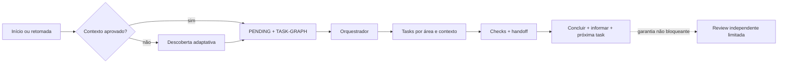

# Agent Harness Kit

> Um harness de desenvolvimento agnóstico de plataforma e orientado a artefatos, com entradas nativas para Codex e Claude Code, aprendizado opcional e um pacote separado para estudar engenharia de harness.

**Versão atual do código-fonte: `0.4.1`.** O projeto é um scaffold operacional executável: agentes capazes seguem seus contratos e validadores. Ele não é um daemon que inicia agentes sozinho ou bloqueia arquivos no sistema operacional.

> 🌐 **Idioma:** Português (Brasil)
>
> **[Ler em English →](README.md)**

[Instalação passo a passo](#instalação-passo-a-passo) · [Instalação contida](docs/EMBEDDED-INSTALLATION.md) · [Como funciona](#como-funciona) · [Arquitetura](docs/ARCHITECTURE.md) · [Status e conclusão](docs/STATUS-AND-COMPLETION.md) · [Distribuição](docs/DISTRIBUTION.md) · [Decisões em aberto](OPEN-DECISIONS.md)

## Projeto greenfield ou harness existente

O Agent Harness Kit funciona tanto em projetos novos quanto em repositórios que já possuem instruções, agentes, regras, conhecimento ou outro harness.

- **Greenfield:** a descoberta cria o primeiro contexto aprovado e o grafo de tarefas.
- **Repositório existente:** o kit preserva as autoridades atuais, instala por coexistência com namespace e só permite cutover depois de revisão humana de equivalência.

Ele não sobrescreve silenciosamente `AGENTS.md`, `CLAUDE.md`, `.agents/`, `.claude/` ou configurações existentes. Veja o [playbook de adoção](harness/playbooks/mature-harness-adoption.md).

## Áudio de explicação do projeto

Ouça uma visão geral em português sobre o propósito e o fluxo do Agent Harness Kit.

https://github.com/user-attachments/assets/4c68f8a0-bfac-4847-b2ea-9adeae24c17c

[Baixar o MP3 em português](media/agent-harness-kit-overview-pt-BR.mp3) · [Ler o roteiro em português](media/overview-script-pt-BR.txt)

## O que o harness entrega

| Área | Comportamento |
| --- | --- |
| Estado durável | Contexto aprovado, decisões, `PENDING.md` humano/macro e `TASK-GRAPH.md` técnico |
| Execução | Dependências, propriedade exclusiva de arquivos, handoffs, checks e avanço automático |
| Contextos | Frontend, backend, dados, infra e integração separados por task/agente quando o host permite |
| Status | Etapa, progresso, pendências por área, bloqueios, próxima ação e caminhos inspecionáveis |
| Frontend | Fluxo padrão de direção visual, mockups, geração de imagens e tradução para código |
| Aprendizado | Modo estudo consentido com notas em Markdown, pasta local, Obsidian, Notion ou outro destino |
| Controle | Duas tentativas de implementação, dois ciclos sem progresso e três expansões de contexto por linhagem |
| Garantia | Revisor independente, no máximo duas reviews e nenhuma espera burocrática após checks aprovados |

Capacidades ausentes degradam de forma explícita. O harness nunca presume MCP, rede, segredos, autenticação, worktrees, criação de chats ou permissões.

## Perfis

| Perfil | Inclui | Indicado para |
| --- | --- | --- |
| `core` | Entrega, grafo, status, revisão e validação | Desenvolvimento sem aprendizado acompanhado |
| `core-learning` | `core` + aprendizado do projeto | Prática guiada e debriefings durante o trabalho |
| `full` | `core-learning` + `learning-pack/` | Entrega e estudo separado de engenharia de harness |

Instalar `core-learning` ou `full` não ativa observação nem publicação. O modo estudo só começa após pedido e consentimento explícitos.

## Pré-requisitos

- Python 3 e um diretório de projeto.
- Codex ou Claude Code para ativação nativa; outras plataformas podem seguir os playbooks neutros.
- Git, múltiplos agentes, sandboxes, MCP e rede são opcionais.

## Instalação passo a passo

Este processo copia uma versão contida do Kit para dentro do seu projeto. Ele não instala um programa no Windows e não inicia agentes sozinho. Os arquivos `AGENTS.md` e `CLAUDE.md` criados na raiz dizem ao Codex ou Claude Code onde encontrar as regras do Kit.

### 1. Antes de começar

- Tenha o [Python 3](https://www.python.org/downloads/) instalado. No Windows, confirme com `python --version`; no macOS/Linux, tente `python3 --version`.
- Tenha uma pasta para o seu projeto. Ela pode estar vazia ou já conter código.
- Se o projeto já for importante, faça um commit ou backup antes da instalação.

### 2. Baixe o Agent Harness Kit

Escolha uma opção:

- **Clone normal:** `git clone https://github.com/Eduardo-Salvador/Agent-Harness-Kit.git`
- **Fork:** no GitHub, clique em **Fork**, copie a URL do seu fork e execute `git clone <URL-DO-SEU-FORK>`.
- **Sem Git:** use **Code → Download ZIP**, extraia o arquivo e renomeie a pasta para `Agent-Harness-Kit`.

Deixe o Kit e seu projeto em pastas separadas, uma ao lado da outra:

```text
teste-harness/
├── Agent-Harness-Kit/   fonte oficial, fork ou ZIP extraído
└── meu-projeto/         projeto que receberá o Kit
```

Não coloque `meu-projeto` dentro de `Agent-Harness-Kit` nem instale o Kit nele mesmo. O instalador bloqueia pastas aninhadas para evitar cópias recursivas e confusão entre a fonte e o projeto.

### 3. Abra o terminal dentro do seu projeto

No Windows, abra `meu-projeto` no Explorador de Arquivos, clique com o botão direito em uma área vazia e escolha **Abrir no Terminal**. O prompt deve terminar com o nome do projeto:

```text
PS C:\...\teste-harness\meu-projeto>
```

O ponto `.` usado nos comandos abaixo significa “a pasta atual”. `..` significa “a pasta anterior”, onde está `Agent-Harness-Kit` no exemplo.

### 4. Escolha o perfil

- Use `core` se quer apenas organizar e executar o desenvolvimento. **Esta é a escolha recomendada para a maioria das pessoas.**
- Use `core-learning` se também pretende pedir modo estudo e guardar anotações durante o projeto.
- Use `full` somente se, além do projeto, quiser estudar a engenharia do próprio harness.

O perfil de aprendizado apenas disponibiliza o recurso. Ele não observa nem cria notas até você pedir e aprovar o destino.

### 5. Faça uma simulação segura

O `--dry-run` mostra o que seria criado sem alterar arquivos:

```powershell
python ..\Agent-Harness-Kit\tools\install.py --profile core --host . --dry-run
```

No macOS/Linux, use:

```bash
python3 ../Agent-Harness-Kit/tools/install.py --profile core --host . --dry-run
```

Revise as linhas iniciadas por `WOULD`. Elas devem apontar para `meu-projeto`, nunca para a pasta-fonte `Agent-Harness-Kit`.

### 6. Instale

Repita o comando sem `--dry-run`:

```powershell
python ..\Agent-Harness-Kit\tools\install.py --profile core --host .
```

No macOS/Linux:

```bash
python3 ../Agent-Harness-Kit/tools/install.py --profile core --host .
```

Se as pastas não estiverem lado a lado, use o caminho completo do instalador entre aspas. Exemplo no Windows:

```powershell
python "C:\caminho\para\Agent-Harness-Kit\tools\install.py" --profile core --host .
```

Ao terminar, linhas `DONE` confirmam a criação de:

- `agent-harness-kit/`, a cópia gerenciada do Kit;
- `AGENTS.md`, ponto de entrada para Codex e agentes compatíveis;
- `CLAUDE.md`, ponto de entrada para Claude Code.

Se `AGENTS.md` ou `CLAUDE.md` já existirem, o instalador preserva o texto do projeto e gerencia apenas um bloco marcado no topo.

### 7. Valide a instalação

Ainda dentro de `meu-projeto`, execute:

```powershell
python agent-harness-kit\tools\validate.py
```

No macOS/Linux:

```bash
python3 agent-harness-kit/tools/validate.py
```

O resultado esperado começa com `VALIDATION PASSED`. Se aparecer `VALIDATION FAILED`, não comece o desenvolvimento antes de corrigir os erros informados.

### 8. Abra uma conversa nova com o agente

Feche a conversa usada antes da instalação e abra um **novo contexto na raiz de `meu-projeto`**. Isso é necessário porque conversas antigas podem manter instruções carregadas antes da existência do Kit.

Normalmente o agente lerá `AGENTS.md` ou `CLAUDE.md` automaticamente. Se ele ignorar o Kit, cole este prompt:

```text
O Agent Harness Kit está instalado neste projeto. Antes de varrer, propor, planejar, informar status ou alterar arquivos, leia o AGENTS.md ou CLAUDE.md aplicável na raiz e siga as instruções referenciadas dentro de agent-harness-kit/. Verifique harness-state/PROJECT-CONTEXT.md e execute o fluxo obrigatório de primeira execução ou retomada antes de responder ao pedido do projeto.
```

Em um projeto sem contexto aprovado, a primeira resposta correta apresenta brevemente o Kit e inicia a entrevista. O agente não deve propor stack, marca, arquitetura ou implementação antes dessa descoberta.

<details>
<summary><strong>Problemas comuns</strong></summary>

- **`python` não foi reconhecido:** instale o Python 3, reabra o terminal e tente `python --version`; no macOS/Linux use `python3`.
- **`can't open file` ou caminho não encontrado:** confira o nome e a localização de `Agent-Harness-Kit`; use o caminho completo entre aspas se necessário.
- **`destination already exists`:** o projeto já possui `agent-harness-kit/`. Não apague `harness-state/`; siga o processo de atualização em [Instalação contida](docs/EMBEDDED-INSTALLATION.md).
- **`separate, non-nested directories`:** a fonte do Kit e o projeto são a mesma pasta ou uma está dentro da outra. Mova-as para ficarem lado a lado.
- **O agente não apresentou o Kit:** confirme que abriu uma conversa nova na raiz de `meu-projeto` e use o prompt de ativação acima.

</details>

## Como funciona



### Retomada e pendências

Na primeira chamada de uma nova janela, em pedidos de retomada ou de status, o agente lê nesta ordem:

1. `harness-state/PROJECT-CONTEXT.md`;
2. `harness-state/PENDING.md`;
3. `harness-state/TASK-GRAPH.md`.

`PENDING.md` guarda decisões, ações humanas e a visão macro do que falta. `TASK-GRAPH.md` guarda ordem, dependências, leases e execução técnica. Toda atualização de progresso/etapa — não apenas um pedido explícito de status — mostra etapa atual, progresso, o que continua sem ação do usuário, pendências humanas e macro, nós ativos/prontos/bloqueados do grafo, bloqueios, próxima ação e caminhos inspecionáveis. Ao perguntar “quais são minhas pendências?”, os itens humanos vêm primeiro.

Todo movimento técnico é persistido em uma nova revisão de `TASK-GRAPH.md` antes de ser informado. `PENDING.md` só é atualizado quando muda uma ação humana ou o resultado macro do projeto; nunca pode ser o único registro do progresso de uma task.

### Contextos, frontend e estudo

- **Contextos:** um contexto novo por task é o padrão. Chats visíveis, subagentes e paralelismo só são usados quando o host oferece e autoriza essas capacidades; caso contrário, há fallback manual ou sequencial com handoff.
- **Frontend:** pedidos de tela usam `frontend-screen` para orquestração. Com screenshots aprovados, `image-to-code` é a skill principal de código, `frontend-screen` confere fidelidade entre desktop e mobile, e `imagegen` cria apenas fotografias/recursos raster temporários. Skills de direção visual continuam disponíveis quando ainda não existe tela aprovada.
- **Estudo:** pedidos como “ativa modo estudo” iniciam a configuração de objetivos, limites de observação e destino exato das notas. Nenhuma nota é criada e nenhum fallback em `docs/` ou serviço remoto é presumido antes de o usuário confirmar um caminho ou um conector/MCP e alvo. Credenciais nunca são gravadas no perfil.

## Mapa do repositório

```text
AGENTS.md / CLAUDE.md   entradas nativas
harness/                papéis, templates e playbooks
docs/                   arquitetura, contratos e políticas
adapters/               mapeamentos Codex, Claude e genérico
.agents/ / .claude/     skills e agentes carregados sob demanda
validation/             fixtures válidas e mutações hostis
tools/                  instalação, validação e empacotamento
learning-pack/          estudo separado de engenharia de harness
```

## Princípios

1. Arquivos, não memória de chat, carregam o estado durável.
2. `PENDING.md` humano/macro e `TASK-GRAPH.md` técnico são autoridades diferentes.
3. Tasks têm ownership exclusivo, contexto progressivo e verificação reproduzível.
4. Implementador e revisor são independentes; não existe terceira review automática.
5. Conclusão aprovada nos checks informa o resultado e segue sem aprovação burocrática.
6. Modelos e ferramentas não ampliam autoridade; capacidades e degradações são explícitas.

## Limitações atuais

- Não há um runtime autônomo separado que abra sessões, integre branches, faça deploy ou publique notas sozinho.
- Leases são contratos validados no grafo, não locks do sistema operacional.
- Criação automática de chats, subagentes e isolamento depende das capacidades reais do host.
- Medição de tokens, limites de tempo e encerramento forçado ainda não são portáveis entre plataformas.

Consulte a [auditoria de prontidão](docs/PUBLICATION-READINESS.md), as [decisões em aberto](OPEN-DECISIONS.md) e a [licença MIT](LICENSE).
