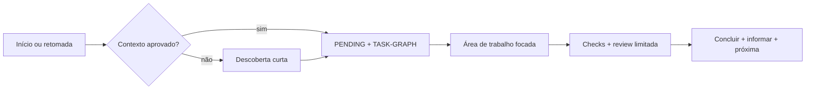

# Agent Harness Kit


<p align="center">
  <strong>Dê aos agentes de código contexto durável, execução limitada e um caminho claro até a conclusão.</strong><br>
  Contratos agnósticos de plataforma com entradas nativas para Codex e Claude Code.
</p>

<p align="center">
  <a href="README.md">English</a> · <a href="#instale-em-30-segundos">Instalação</a> · <a href="docs/ARCHITECTURE.md">Arquitetura</a> · <a href="docs/EMBEDDED-INSTALLATION.md">Atualização contida</a>
</p>

**Versão do código-fonte: `0.5.0`.** O Kit é um scaffold executável e orientado a artefatos. Agentes capazes seguem seus arquivos, contratos e validadores; ele não é um daemon que inicia agentes ou bloqueia o sistema operacional.

## Áudio de explicação do projeto

Ouça uma explicação curta em português sobre o que o projeto faz e como seu fluxo funciona.

https://github.com/user-attachments/assets/4c68f8a0-bfac-4847-b2ea-9adeae24c17c

[Baixar o MP3 em português](media/agent-harness-kit-overview-pt-BR.mp3) · [Ler o roteiro em português](media/overview-script-pt-BR.txt)

## Por que ele existe

| Sem coordenação durável | Com o Kit |
| --- | --- |
| O agente varre tudo e tenta adivinhar o contexto | O contexto aprovado é lido antes de buscas amplas |
| Decisões humanas se misturam com tasks técnicas | `PENDING.md` e `TASK-GRAPH.md` têm autoridades separadas |
| Reviews se repetem indefinidamente | Uma review e no máximo uma re-review focada |
| A conclusão espera aprovação cerimonial | O trabalho aprovado nos checks é concluído, informado e avança |
| Vários agentes colidem | Áreas, leases de arquivos e handoffs são explícitos |
| Notas de estudo surgem em pastas arbitrárias | O estudo só começa após aprovação do destino |



## Projeto novo ou harness existente

Em um projeto vazio, a primeira resposta apresenta o Kit e inicia uma descoberta curta antes de propor tecnologia, arquitetura ou direção visual. Em um repositório maduro, o Kit preserva as instruções atuais e usa coexistência com namespace; ele nunca sobrescreve silenciosamente `AGENTS.md`, `CLAUDE.md`, `.agents/`, `.claude/` ou outra autoridade. Veja o [playbook de adoção madura](harness/playbooks/mature-harness-adoption.md).

## Instale em 30 segundos

Com o [`uv`](https://docs.astral.sh/uv/) instalado, instale a CLI uma vez:

```bash
uv tool install agent-harness-kit-cli
```

Depois, execute dentro de cada projeto que receberá o Kit:

```bash
agent-harness install
```

Depois, abra um **novo contexto do agente na raiz desse projeto**. O comando instala o perfil recomendado `core`, cria a pasta contida `agent-harness-kit/` e adiciona blocos gerenciados ao `AGENTS.md` e `CLAUDE.md` da raiz sem substituir instruções existentes.

```bash
# Apenas simular
agent-harness install --dry-run

# Incluir suporte consentido ao aprendizado no projeto
agent-harness install --profile core-learning
```

Para clone/ZIP, iniciantes, uso offline, solução de problemas e atualização contida, veja a [instalação passo a passo](docs/EMBEDDED-INSTALLATION.md). A interface original `python tools/install.py` continua suportada.

## O que é instalado

- Contexto, regras, capacidades e decisões aprovadas do projeto.
- Decisões, ações humanas e lacunas macro em `harness-state/PENDING.md`.
- Ordem técnica, dependências, leases e transições em `harness-state/TASK-GRAPH.md`.
- Tentativas, expansão de contexto e review independente limitadas—sem terceira review automática.
- Status obrigatório: etapa, progresso, trabalho automático, as duas visões de pendências, bloqueios, próxima ação e caminhos.
- Contextos separados para frontend, backend, dados, infraestrutura, integração e estudo quando o host permite.

## Modo hackathon

Ao pedir “modo hackathon”, um MVP com prazo curto ou construção focada em demo, o Kit comprime a descoberta para no máximo duas perguntas coesas antes de propor contexto e grafo. Ele busca uma fatia vertical demonstrável, divide trabalho isolado por área/agente, integra cedo, usa review independente leve por padrão e termina com demo ensaiada, atalhos visíveis e lacunas pós-MVP. É mais rápido, mas não remove leases, checks, status ou o limite de duas reviews. Veja o [modo hackathon](docs/HACKATHON-MODE.md).

## Como a execução flui



`PENDING.md` responde “o que você precisa de mim?” e acompanha o que falta no nível do produto. `TASK-GRAPH.md` controla a execução técnica. O agente lê os dois—nessa ordem depois do contexto—e persiste mudanças do grafo antes de informar progresso.

## Um grafo de tarefas mais inteligente

O `TASK-GRAPH.md` existente também carrega contexto de código focado por nó: `read_set` diz o que o agente deve abrir primeiro, `write_set` continua sendo o lease exclusivo e `impact_set` limita a review de regressões. `context_provenance` registra a revisão do código e como essas pistas foram encontradas. Uma ferramenta aprovada e atualizada como o [Graphify](https://github.com/Graphify-Labs/graphify) pode enriquecer esses campos, mas nunca cria um grafo concorrente nem altera o estado das tasks automaticamente.

## Perfis

| Perfil | Inclui | Melhor uso |
| --- | --- | --- |
| `core` | Entrega, grafo, status, review e validação | Maioria dos projetos |
| `core-learning` | `core` mais aprendizado opcional do projeto | Prática guiada e debriefings |
| `full` | `core-learning` mais o pacote separado de estudo do harness | Estudar a própria engenharia de harness |

O aprendizado nunca é ativado silenciosamente. O usuário escolhe o caminho Markdown, local do Obsidian, alvo/MCP do Notion ou outro destino exato antes da criação de qualquer nota.

## Limites honestos

- O Kit coordena agentes capazes por arquivos; não abre chats, integra branches, faz deploy ou publica notas autonomamente.
- Leases são contratos validados, não locks do sistema operacional.
- Threads, subagentes, worktrees, MCPs, rede e modelo dependem das capacidades e autorizações reais do host.
- Um grafo de conhecimento pode reduzir varreduras amplas, mas apenas consultas focadas e orçamentos de execução evitam desperdício; nenhuma ferramenta garante menos tokens.

Leia a [auditoria de prontidão](docs/PUBLICATION-READINESS.md), o [contrato de validação](docs/VALIDATION.md), as [decisões em aberto](OPEN-DECISIONS.md) e a [licença MIT](LICENSE).
